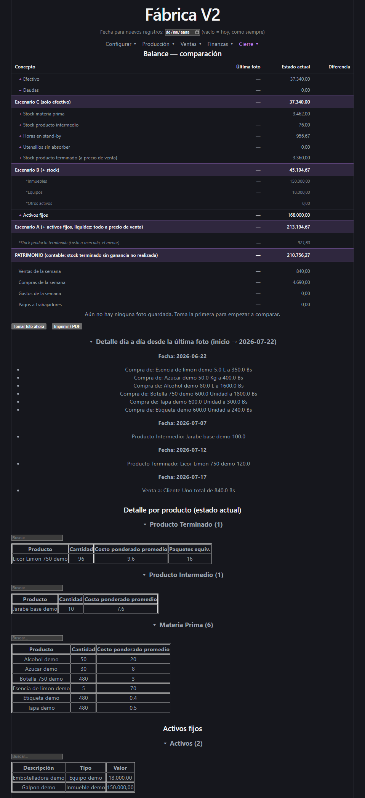
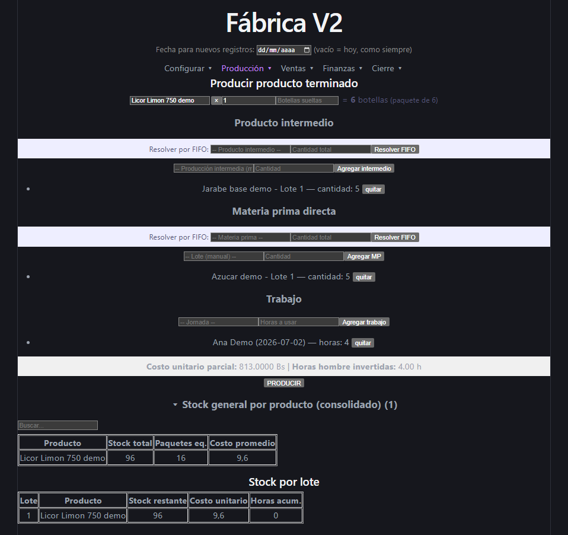
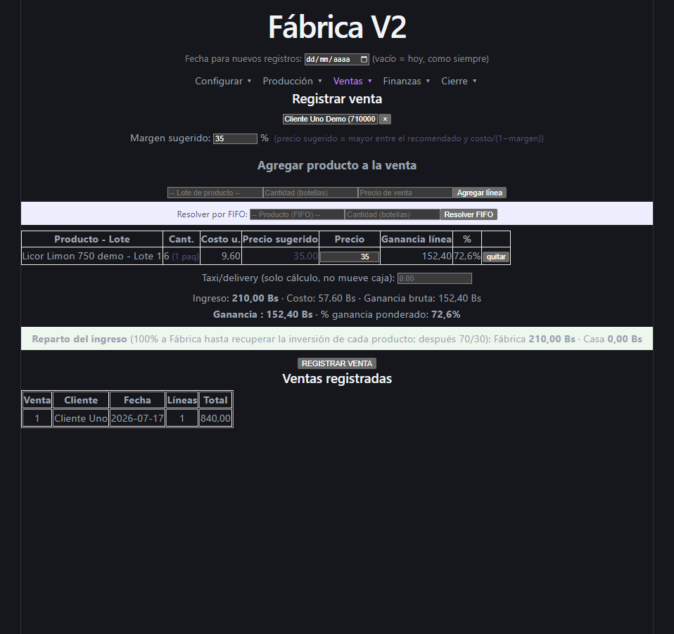
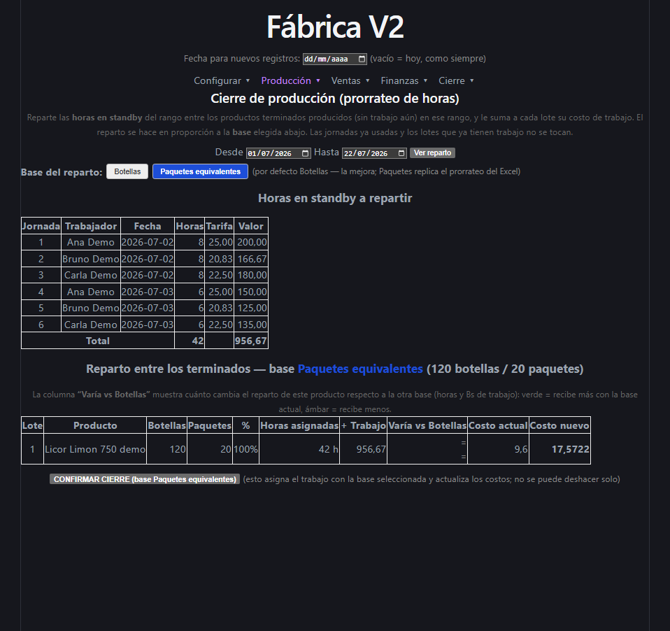
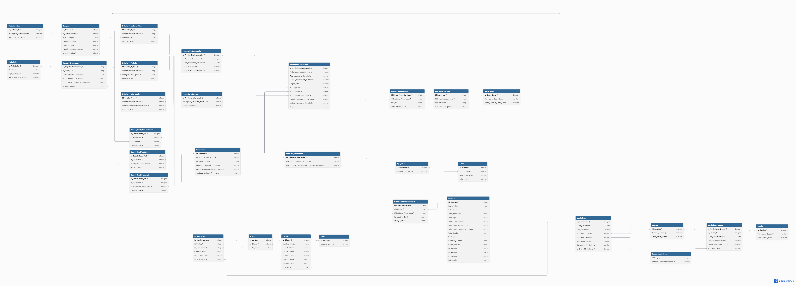

# Fábrica V2 — Sistema de gestión para una fábrica de bebidas

Sistema de gestión integral para una fábrica de bebidas: controla de extremo a
extremo la operación —compra de materia prima, personal, producción por lotes,
ventas, caja y costeo— con **trazabilidad por lote** en toda la cadena.

Nació como una herramienta en Excel/VBA y evolucionó a una arquitectura moderna
por capas: **PostgreSQL + FastAPI + React**, con reportería en Power BI y
empaquetado en Docker para probarlo con un solo comando.

> **Nota sobre los datos:** este repositorio es público y **no contiene ninguna
> información del negocio real**. Todo lo que se ve al levantar la demo son
> datos ficticios (`docker/seed_demo.sql`).

---

## Probarlo en un comando (Docker)

Con [Docker Desktop](https://www.docker.com/products/docker-desktop/) instalado
y corriendo:

```bash
docker compose up --build
```

Luego abrir **http://localhost:8080**. La app arranca ya con datos de ejemplo
(productos, clientes, proveedores, compras, producción y una venta) para que las
pantallas se vean con contenido. Para apagar y borrar todo: `docker compose down -v`.

Detalles de puertos, modo con datos reales y conexión de Power BI en
[`docker/README.md`](docker/README.md).

---

## 📸 Capturas

> Todas las capturas usan los **datos ficticios del modo demo** — no hay
> información de ningún negocio real.

**Balance — tres escenarios de valorización y patrimonio contable**



**Producción — costeo en cadena, consumo de insumos por lote y resolución FIFO**



**Ventas — precio real, margen y reparto 70/30 con recuperación de inversión**



**Cierre de producción — prorrateo de horas standby, con vista previa idempotente**



---

## Qué resuelve

- **Inventario y compras** de materia prima, con control de stock por lote.
- **Personal y jornadas**, con registro de horas trabajadas.
- **Producción en dos etapas** (producto intermedio → producto terminado), cada
  una consumiendo materia prima, mano de obra y/o intermedios previos, con
  trazabilidad del lote exacto consumido.
- **Clientes y ventas** con geolocalización por sector (análisis de zonas vía
  Google Maps) y precio real de venta por producto.
- **Flujo de caja**: libro único de movimientos sobre múltiples cuentas
  (billeteras, cajas, banco), deudas con su historial y activos fijos.
- **Costeo y rentabilidad**: costo unitario por lote y prorrateo mensual de
  gastos fijos por producto según horas de uso de las instalaciones.
- **Balance semanal** como foto congelada, con escenarios de valorización y
  patrimonio.
- **Movimientos de inventario** (mermas, ajustes, devoluciones, reprocesos)
  bajo el principio de *nunca borrar, siempre registrar el evento*.

---

## Stack tecnológico

| Capa          | Tecnología                     | Estado       |
|---------------|--------------------------------|--------------|
| Base de datos | PostgreSQL 16                  | Implementado |
| Backend       | Python + FastAPI               | Implementado |
| Frontend      | React + Vite                   | Implementado |
| Reportería    | Power BI (usuario de solo lectura) | Implementado |
| Empaquetado   | Docker + docker-compose + nginx | Implementado |
| Mapas         | Google Maps API                | Implementado |

---

## Arquitectura

Aplicación por capas con separación estricta de responsabilidades:

```
Navegador (React + Vite)
        │  HTTP / JSON
        ▼
API REST (FastAPI)
   ├── rutas/        endpoints y validación de entrada
   ├── servicios/    lógica de negocio (costeo, balance, producción)
   └── modelos       acceso a datos
        │  SQL
        ▼
PostgreSQL 16  ── 31 tablas, integridad referencial, restricciones CHECK
        ▲
        │  solo lectura
Power BI (reportería)
```

Principios aplicados en el modelo de datos:

- **Identificadores autogenerados** como clave primaria; relaciones por Id.
- **Sin datos duplicados**: la información derivada (totales, descripciones) se
  obtiene por JOIN, no se almacena.
- **Trazabilidad por lote** en compras, producción y ventas.
- **Libro de movimientos** como única fuente de verdad para los saldos.
- **Validación en la base** (restricciones `CHECK` y `NOT NULL`), además de la
  del backend.

Diagrama entidad-relación:



El modelo editable está en [`fabrica_v2_modelo.dbml`](fabrica_v2_modelo.dbml)
(se abre en [dbdiagram.io](https://dbdiagram.io)) y el esquema completo en
[`fabrica_v2_postgres.sql`](fabrica_v2_postgres.sql).

---

## Estructura del repositorio

```
.
├── backend/                 API FastAPI (rutas, servicios, modelos, migraciones)
├── frontend/                Interfaz React + Vite
├── docker/                  Dockerfiles, nginx, init y seed de demostración
├── reportes-powerbi/        Documentación de medidas DAX y visuales de Power BI
├── docker-compose.yml       Orquestación (modo demo, datos ficticios)
├── docker-compose.real.yml  Overlay para evaluar con un respaldo real (local)
├── fabrica_v2_postgres.sql  Esquema completo de PostgreSQL
├── fabrica_v2_modelo.dbml   Modelo de datos editable (dbdiagram.io)
├── fabrica_diagrama_ER.png  Diagrama entidad-relación
├── DECISIONES_DISENO.md     Decisiones de diseño y su porqué
└── MEJORAS_FUTURAS.md       Bitácora de mejoras (implementadas y pendientes)
```

---

## Desarrollo local

Requiere PostgreSQL 16, Python 3.12+ y Node 18+.

```bash
# Base de datos: crear una base vacía y cargar el esquema
psql -d fabrica_v2 -f fabrica_v2_postgres.sql

# Backend
uvicorn app.main:app --reload --port 8000 --app-dir backend
# Documentación interactiva de la API en http://localhost:8000/docs

# Frontend
npm --prefix frontend install
npm --prefix frontend run dev        # http://localhost:5173
```

La configuración por entorno (cadena de conexión, orígenes CORS, modo de datos)
se controla por variables de entorno; ver [`docker/README.md`](docker/README.md)
y `backend/app/config.py`.

---

## Documentación de diseño

Dos documentos acompañan el código y explican **por qué** está hecho así:

- [`DECISIONES_DISENO.md`](DECISIONES_DISENO.md) — decisiones de arquitectura y
  de negocio, cada una con su justificación.
- [`MEJORAS_FUTURAS.md`](MEJORAS_FUTURAS.md) — bitácora de mejoras, con el
  detalle de qué se implementó y qué queda pendiente.
